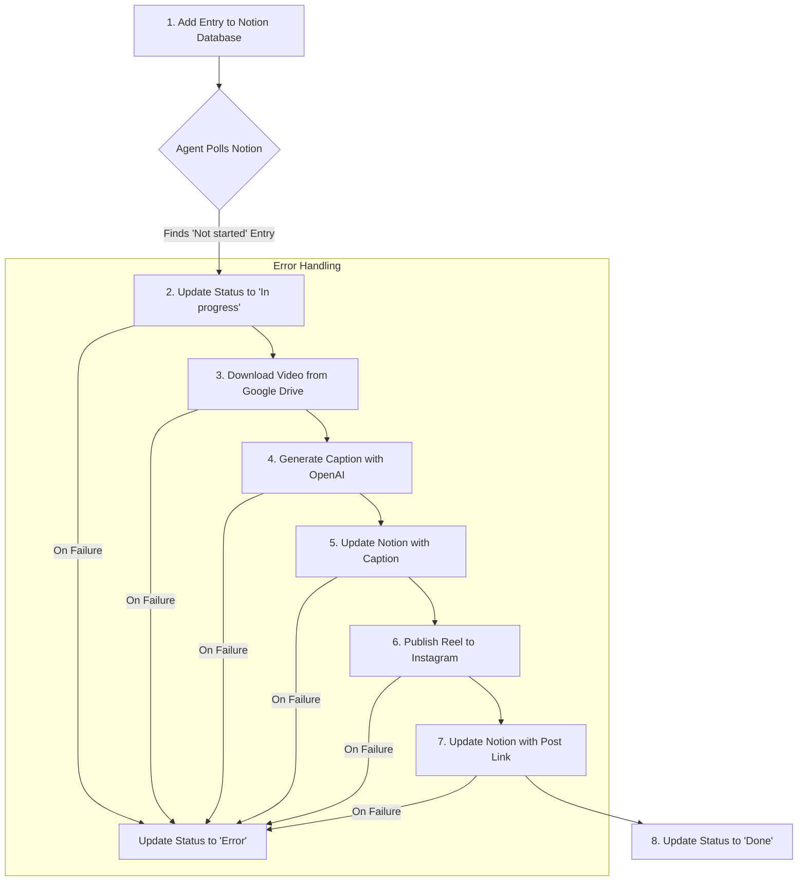

#  Instagram AI Automation Agent

This AI-powered agent automates your entire Instagram content pipeline. It monitors a Notion database, downloads video content from Google Drive, uses OpenAI (GPT-4o) to generate engaging captions, and publishes the final video as a Reel to your Instagram account.

  <!-- TODO: Replace with an actual GIF of the agent running -->

## ✨ Features

- **📝 Notion-Driven Workflow**: Manage your entire content schedule from a simple Notion database.
- **📥 Automated Content Fetching**: Automatically downloads video files from Google Drive links provided in Notion.
- **🤖 AI-Powered Captions**: Leverages OpenAI's GPT-4o to generate creative and relevant captions with hashtags for your videos.
- **🚀 Automatic Publishing**: Uploads and publishes the video as a Reel to your specified Instagram account.
- **🔄 Real-time Status Updates**: Updates the status of each post in your Notion database as it moves through the pipeline (e.g., "In progress", "Done", "Error").
- **⚙️ Simple CLI Management**: Comes with an easy-to-use command-line interface to start, stop, and debug the agent.
- **🛡️ Robust Error Handling**: If a step fails, the agent marks the entry with an "Error" status in Notion for easy tracking.

##  workflow-diagram


## 🛠️ Setup and Installation

Follow these steps to get the agent up and running.

### 1. Prerequisites

- **Node.js** (v18 or higher)
- **npm** or **yarn**
- Accounts for:
  - [Composio](https://composio.dev/)
  - [Notion](https://www.notion.so/)
  - [Instagram](https://www.instagram.com/) (Must be a Business or Creator account)
  - [Google Drive](https://www.google.com/drive/)
  - [OpenAI](https://platform.openai.com/)

### 2. Clone the Repository

```bash
git clone https://github.com/your-username/your-repo-name.git
cd your-repo-name
```

### 3. Install Dependencies

```bash
npm install
```

### 4. Connect Your Accounts with Composio

This project uses Composio to securely manage connections to third-party services. The easiest way to set this up is by running the included setup script.

First, sign up on [Composio](https://composio.dev/) and get your **API Key**. You will need this for the next step.

This script will prompt you for your Composio API Key and then provide authentication links for Notion, Instagram, Google Drive, and OpenAI. Follow the on-screen instructions.

### 5. Configure Environment Variables

Create a `.env` file in the root of the project by copying the example file:
```bash
cp .env.example .env
```

Now, open the `.env` file and fill in the required values:

| Variable             | Description                                                                                                                                                                                                                          |
| -------------------- | ------------------------------------------------------------------------------------------------------------------------------------------------------------------------------------------------------------------------------------ |
| `COMPOSIO_API_KEY`     | Your API key from the Composio dashboard.      
| `OPENAI_API_KEY`     | Your API key from Open Ai.    
| `NOTION_DATABASE_ID` | The ID of the Notion database you want to monitor. [How to find it?](https://developers.notion.com/docs/working-with-databases#finding-a-database-id)                                                                                  |
| `INSTAGRAM_USER_ID`  | The ID of your Instagram Business/Creator account. You can find this by running the "Check Connections" option in the CLI after connecting your Instagram account. It's also available in the Composio dashboard connection details. |
| `POLLING_INTERVAL_MS`| (Optional) How often the agent checks Notion for new entries, in milliseconds. Defaults to `30000` (30 seconds).                                                                                                                     |

### 6. Set Up Your Notion Database

The agent requires your Notion database to have a specific structure. Create a database with the following columns:

| Column Name         | Type        | Description                                                                          |
| ------------------- | ----------- | ------------------------------------------------------------------------------------ |
| **Video Brief**     | `Title`     | A short description of the video. The AI will use this to generate a caption.        |
| **Drive Link**      | `URL`       | A public Google Drive link to the video file.                                        |
| **Generated Caption** | `Text`      | The agent will automatically fill this with the AI-generated caption.                |
| **Status**          | `Status`    | **Crucial!** Must have the options: `Not started`, `In progress`, `Done`, and `Error`. |
| **Post Link**       | `URL`       | The agent will automatically fill this with the final Instagram post URL.              |

> **Tip:** You can create a Notion template for this database to speed up your content creation process.

## 🚀 Usage

### 1. Start the Agent

Run the following command to start the agent's command-line interface:
```bash
npm run dev
```

You will see a menu with the following options:
```
Menu:
1. Start Agent
2. Stop Agent
3. Check Connections
4. Exit

Enter your choice:
```

- **Start Agent**: Begins monitoring the Notion database for new entries to process.
- **Stop Agent**: Gracefully stops the agent.
- **Check Connections**: Runs a series of tests to ensure all API connections are active and working correctly. This is useful for troubleshooting.
- **Exit**: Closes the application.

### 2. Add Content to Notion

To trigger the automation, simply add a new row to your Notion database and set its **Status** to `Not started`. Fill in the **Video Brief** and **Drive Link**.

The agent will pick it up on its next polling cycle and begin the automation process. You can watch the console for real-time logs of its progress!

## 📂 Project Structure

Here is a brief overview of the key files in this project:

```
.
├── src/
│   ├── instagram-automation-agent.ts  # Core logic for the agent's workflow.
│   ├── composio.ts                    # A client wrapper for the Composio SDK.
│   ├── connection.ts                  # Manages and debugs service connections.
│   ├── authConfig.ts                  # Loads and manages environment variables.
│   ├── auth-setup.ts                  # (Helper) Script for initial auth setup.
│   └── tool-checker.ts                # (Helper) Script for checking available tools.
├── index.ts                           # The main entry point and CLI for the agent.
├── package.json                       # Project dependencies and scripts.
└── .env.example                       # Template for environment variables.
```

## ⚠️ Troubleshooting

- **"No active connections found"**: This usually means the authentication process via Composio was not completed or has expired.
  1.  Run `npm start` and select option `3. Check Connections` to get detailed debug info.
  2.  If connections are missing or inactive, run `npm run setup` again to re-authenticate the required services.
  3.  Verify your connections are active in your [Composio Dashboard](https://platform.composio.dev/).

- **Instagram Media Processing Timed Out**: Instagram sometimes takes a while to process larger video files. The agent waits for up to 4 minutes (`30 retries * 8 seconds`). If it fails, check the video file format and size.

- **Invalid Drive Link**: Ensure the Google Drive link is accessible. While the agent can download from private files (as it's authenticated), public links are often more reliable.

## 🤝 Contributing

Contributions are welcome! Please feel free to submit a pull request or open an issue.

## 📄 License

This project is licensed under the MIT License. See the [LICENSE](LICENSE) file for details.

---
